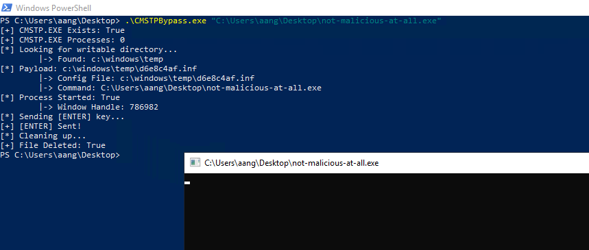

# CMSTP UAC Bypass

Tested on the following Windows version:
```
OS Name:                   Microsoft Windows Server 2019 Standard
OS Version:                10.0.17763 N/A Build 17763
```

The initial research was done by [Oddvar Moe](https://oddvar.moe/) in his blog: [Research on CMSTP.exe](https://oddvar.moe/2017/08/15/research-on-cmstp-exe/). Oddvar Moe also published a PowerShell script demonstrating this: [UACBypassCMSTP.ps1 ](https://gist.github.com/api0cradle/cf36fd40fa991c3a6f7755d1810cc61e#file-uacbypasscmstp-ps1)

This then led to [Andres Marques](https://twitter.com/_zc00l) wrapping this up in a .NET and PowerShell tool in his blog [How to bypass UAC in newer Windows versions](https://0x00-0x00.github.io/research/2018/10/31/How-to-bypass-UAC-in-newer-Windows-versions.html).

I wasn't a fan of the PowerShell wrapping and I needed this to work solely in .NET, so I made some changes. Note: I only tested this with an on-disk payload. Additionally, I tested this quite extensively on the Windows 2019 with the UAC Setting as `PromptForNonWindowsBinaries`. 

Finally, it can be quite awkward. I have two _exact_ builds of Windows Server 2019, and it failed on one quite often. However, the original PowerShell script worked on the other. If anyone knows why this is behaving the way it is, let me know :)

The original payload from [Andres Marques](https://twitter.com/_zc00l):

```csharp
function UpgradeMe
{
    Param(
        [Parameter(Mandatory = $true, Position = 0)]
        [string]$Command
    )
	$base64=""
    if(-not ([System.Management.Automation.PSTypeName]'CBP').Type)
    {
    	[Reflection.Assembly]::Load([Convert]::FromBase64String($base64)) | Out-Null
    }
    [CBP]::Execute($Command)
}
```
Where `$base64` is from the blog: https://0x00-0x00.github.io/research/2018/10/31/How-to-bypass-UAC-in-newer-Windows-versions.html

## Usage

```
execute-assembly /tmp/CMSTPBypass.exe c:\windows\tasks\beacon.exe
```
## Example



